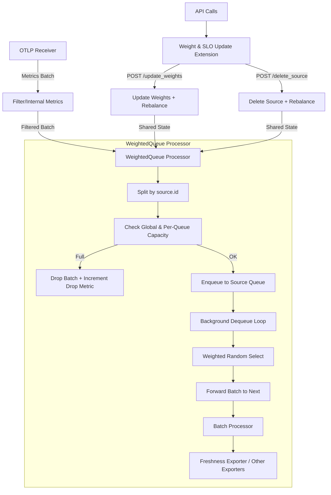

# **Custom OpenTelemetry Collector for Priority-Aware and Freshness-Driven Telemetry**

<p align="center"> <a href="https://github.com/open-telemetry/opentelemetry-collector">  </a> <a href="#weightedqueueprocessor">  </a> <a href="#freshnessexporter"></a> <a href="#weightupdateextension">  </a> <a href="https://go.dev/dl/">  </a> <a href="https://github.com/open-telemetry/opentelemetry-collector-releases/releases/tag/v0.142.0">  </a>     </p>

This project provides a **custom OpenTelemetry Collector distribution** designed for **priority-aware** and **freshness-driven telemetry handling** in **multi-tenant environments**.

It introduces a **stateful, weighted per-tenant queueing processor**, a **freshness-aware metrics exporter** for SLO evaluation, and a lightweight **HTTP control extension** for safe runtime adaptation.

The purpose of this collector is to enable **priority-aware** and **SLO-driven telemetry forwarding** in **multi-tenant observability pipelines**, where multiple independent sources share a common collector and backend.

This design turns the OpenTelemetry Collector from a passive relay into an **active, policy-enforcing data-plane component**, suitable for **research, experimentation, and future upstream integration**.

## **Conceptual Overview**
In modern observability deployments, telemetry from multiple independent tenants (for example, **edge sites**, **operators**, or **application domains**) is often aggregated by a shared collector. Under high load, this leads to two fundamental challenges:

1. **Noisy neighbors** — one tenant can overwhelm the collector and degrade observability for others  
2. **Priority and SLO enforcement** — some tenants must receive preferential treatment to maintain freshness, reliability, or contractual SLOs  

This custom collector addresses these challenges by introducing **explicit per-tenant queueing** combined with **weighted scheduling**. Each tenant’s telemetry is isolated in its own queue, and forwarding decisions are made probabilistically according to configurable **weights**.

Weights can be **updated at runtime** via an HTTP API, enabling **dynamic, SLO-aware control** without restarting the collector.

This component acts as a **data-plane enforcement primitive** that can be driven by external **policy engines**, **planners**, or **learning-based controllers**.

## **Tenant Model and Source Identification**
Each telemetry source represents a **logical tenant**, such as an edge cluster, operator, or application group.

Tenants are identified by a configurable **resource attribute** attached to incoming metrics. By default, the processor uses ``source.id``.

All metric batches sharing the same ``source.id`` value are treated as belonging to the same tenant and are routed through the same internal queue.

This establishes:
- **Isolation** between tenants via independent queues  
- **Controlled sharing** of collector resources via weighted scheduling

> **Terminology note**  
> Throughout this README, the terms **tenant** and **source** are used interchangeably.  
> A tenant corresponds to a logical telemetry source identified by a resource attribute
> (default: ``source.id``), such as an edge site, operator, or application domain.

## **Key Components**
### **Weighted Queue Processor** (``weightedqueueprocessor``)   

A custom **metrics processor** that:

- Groups incoming metric batches by a configurable resource attribute (default: ``source.id``)
- Maintains a separate bounded queue per tenant
- Automatically detects new tenants and assigns **equal weights** by default
- Forwards batches using **weighted random selection**
- Enforces **global** and **per-tenant** capacity limits
- Exposes internal metrics for observability and analysis

The processor is implemented using **official OpenTelemetry Collector interfaces** and operates fully within standard collector semantics.

### **Freshness Exporter** (``freshnessexporter``)

A custom **metrics exporter** that monitors **telemetry freshness** (end-to-end latency) on a per-tenant basis.

The exporter computes freshness for incoming metric batches in real time using an upstream-provided timestamp and evaluates **SLO compliance** before exposing aggregated results via the Collector’s internal telemetry endpoint.

Key characteristics:

- **Purpose**: Monitor how *fresh (timely)* metric batches are when they reach this collector stage
- **Data source**: Uses the ``initial_timestamp`` resource attribute set by an upstream collector
- **Freshness calculation**:  
  ``freshness = now (UnixNano) − initial_timestamp``
- **Granularity**: Per tenant / source (configurable resource attribute, default: ``source.id``)
- **Thresholds**:
  - Configurable **per tenant**
  - **Runtime-updatable** via HTTP API
  - Default fallback threshold: **5 seconds**
- **SLO evaluation**:
  - A batch is considered **good** if ``freshness ≤ threshold`` for its tenant
- **Initial values**:
  - Optional static configuration via ``initial_slos`` in exporter config
- **Auto-registration**:
  - New tenants automatically receive the default SLO when first observed
- **Runtime control**:
  - Reuses the existing ``weightupdateextension`` for SLO updates (default port ``4500``)

This exporter enables **quantitative, per-tenant freshness monitoring**, making telemetry
timeliness explicit and measurable.

In distributed observability pipelines, late telemetry can be as harmful as missing data.
By evaluating freshness at the collector boundary, the exporter allows freshness to be
treated as a **first-class SLO signal**, suitable for monitoring, alerting, and adaptive control.

### **Weight & SLO Update Extension** (``weightupdateextension``)

A lightweight **HTTP extension** that exposes runtime control over **tenant weights** and **per-tenant freshness SLO thresholds**.

It provides the following endpoints:

- ``POST /update_weights``
  Updates tenant weights dynamically using a JSON payload, for example:  
  ```json
  {
    "weights": {
      "src1": 0.6,
      "src2": 0.4
    }
  }
  ``` 

  Weights must sum approximately to ``1.0``.

- ``GET /weights``  
Returns the currently active weights and the number of detected tenants.

- ``POST /delete_source``  
Deletes a tenant queue (by tenant id) and rebalances scheduling state accordingly.

The extension shares state directly with the processor using **OpenTelemetry-supported patterns**, enabling safe and low-latency runtime updates.

Additional endpoints for freshness SLO management:

- ``POST /slo/update``  
  Updates the freshness SLO threshold for a specific tenant.

- ``GET /slo?source=<name>``  
  Returns the currently configured freshness SLO threshold for a tenant.

- ``GET /slo/all``  
  Returns freshness SLO thresholds for all known tenants.

## **Configuration vs Runtime State**

This collector uses a **static pipeline configuration** defined in ``config.yaml`` (receivers → processors → exporters). The pipeline graph and component wiring are fixed at startup.

The ``weightedqueueprocessor`` is intentionally **stateful** at runtime:

- It maintains **in-memory per-tenant queues** (bounded buffers).
- It maintains **runtime scheduling state** (tenant weights) that controls how queues are drained.
- It maintains **runtime freshness SLO thresholds** used by the freshness exporter for per-tenant SLO evaluation.

The HTTP API provided by ``weightupdateextension`` updates **runtime scheduling state only**. It does **not** modify the collector pipeline configuration, receiver/exporter settings, or processor ordering. 

The API provides a control-plane hook through which external logic can influence internal scheduling behavior without participating in the core telemetry execution path.

This distinction matters: the collector is **not** hot-reloading its configuration; it is updating **internal scheduling state** used for queue draining. This preserves OpenTelemetry’s static configuration model while enabling safe runtime adaptation.

## **Scheduling Semantics**

Forwarding decisions are made using **weighted random selection** across all active tenant queues.

At each dequeue opportunity:
- one tenant queue is selected with probability proportional to its configured weight  
- one batch from that queue is forwarded downstream  

This provides:
- **probabilistic fairness** across tenants  
- **priority differentiation** without strict rate enforcement  
- convergence to configured weights over time  

The processor **does not guarantee exact per-window throughput ratios**. Instead, it guarantees that over a sufficiently large number of forwarded batches, each tenant’s share converges to its assigned weight.

This design choice keeps the processor **simple**, **efficient**, and suitable for **high-throughput telemetry pipelines**.


## **Overload and Backpressure Behavior**

The processor enforces both **global** and **per-tenant** capacity limits.

When a queue exceeds its configured capacity:
- incoming batches for that tenant are **dropped**
- drops are **logged** and **exposed via metrics**
- upstream backpressure naturally propagates (for example, through ``otlp`` retry or drop behavior)

Importantly:
- **no blocking** is introduced in the collector pipeline  
- overload in one tenant **does not stall others**  
- the collector maintains **availability under stress**

This enables **predictable degradation** and makes overload behavior explicit and observable.

## **Runtime Updates and Safety Guarantees**

Runtime updates are designed to be **safe, bounded, and non-disruptive**.

### **Validation invariants**
When applying a weight update, the system enforces:

- All weights are **non-negative**.
- The update includes **exactly one weight per active tenant queue** (no missing or extra tenants).
- Weights must sum approximately to ``1.0`` (within a small tolerance).
- Updates that violate invariants are rejected with a clear error response and **do not change** the current scheduling state.
- Updates are applied **atomically**, ensuring that scheduling state is never observed in a partially updated or inconsistent form.

### **Update scope**
A weight update affects **only** the selection probability used by the processor’s dequeue loop (i.e., how queues are drained). It does not:

- change the collector pipeline graph
- add/remove processors/exporters dynamically
- alter receiver behavior
- modify resource attributes or telemetry content

### **Stability under load**
The processor is designed for **availability-first behavior** under overload:

- Queues are **bounded** (per-tenant and/or global limits).
- When a queue is full, incoming batches for that tenant are **dropped**.
- Drops are logged and exposed via metrics.
- Failures propagate upstream through normal Collector semantics, enabling graceful retry/drop behavior without crashing the collector.


## **Observability**

The processor exposes Prometheus-style metrics, including:

- ``weightedqueue_queue_length{source="..."}`` (gauge)  
  Current queue length per tenant. High values indicate backlog/starvation risk for that source.

- ``weightedqueue_dropped_batches{source="..."}`` (counter)  
  Cumulative number of dropped metric batches per tenant due to capacity limits. A non-zero value signals actual data loss.

These metrics enable:
- **Per-tenant visibility** — identify which sources experience pressure or starvation.
- **Fairness & priority analysis** — compare queue lengths/drops across different weights.
- **SLO compliance monitoring** — track drops (data loss) and backlog (latency risk) under varying loads.
- **Adaptive control** — detect violations (e.g., high drops for a critical source) and trigger API weight updates in real-time.
- **Overload experiments** — quantify how the system sheds load gracefully instead of failing.

The freshness exporter exposes additional Prometheus-style counters:

- ``otelcol_freshness_total_batches_total{source="..."}``  
  Total number of metric batches observed per tenant.

- ``otelcol_freshness_good_batches_total{source="..."}``  
  Number of metric batches whose freshness is within the configured SLO threshold.

These metrics enable:
- **Freshness SLO monitoring** — quantify how often telemetry meets timeliness requirements
- **Per-tenant SLO compliance analysis**
- **Closed-loop control** — adjust weights or SLOs in response to observed violations
- **Research experiments** — study the interaction between queueing, prioritization, and freshness under load

Observed freshness violations can be used to trigger runtime SLO or weight updates via the HTTP API, enabling adaptive behavior without restarting the collector.

## Flow Diagram
The following diagram illustrates the runtime flow of metric batches through the collector and the interaction between the processor and the control extension:



## Intended Use Cases
This component is designed for:
- **multi-tenant observability aggregation**
- **priority-aware telemetry forwarding**
- **SLO-driven observability control**
- **overload testing and failure analysis**
- **research on adaptive observability pipelines**

## Project Structure
```
otel-prioqueue-collector/
├── prioqueue-collector/
│   ├── manifest.yaml                 # OCB manifest: defines modules, versions, and build output
│   └── config.yaml                   # Collector runtime config (receivers, processors, exporters)
│
├── weightupdateextension/            # Custom OTEL extension: exposes HTTP API for weight + SLO updates
│   ├── config.go                     # Extension configuration schema
│   ├── extension.go                  # HTTP server + request handlers (/update_weights, /slo/*, etc.)
│   ├── factory.go                    # OTEL factory registration
│   ├── shared.go                     # Shared runtime state (weights, sources, SLO thresholds)
│   └── go.mod
│
├── weightedqueueprocessor/           # Custom OTEL processor: weighted per-source queueing
│   ├── config.go                     # Processor configuration schema
│   ├── processor.go                  # Queueing + weighted dequeue logic + capacity enforcement
│   ├── factory.go                    # OTEL factory registration
│   └── go.mod
│
├── freshnessexporter/                # Custom OTEL exporter: freshness evaluation + SLO compliance metrics
│   ├── config.go                     # Exporter config (tenant attribute, initial_slos, defaults)
│   ├── exporter.go                   # Freshness calculation + "good/total" counters emission
│   ├── factory.go                    # OTEL factory registration and wiring into the pipeline
│   ├── go.mod                        # Go module definition for the exporter component
│
├── test-telemetry.py                 # Optional helper script for generating synthetic metrics
├── requirements.txt                  # Python dependencies for the test telemetry script
│
├── Makefile                          # Build, release, multi-arch Docker, and tooling commands
├── Dockerfile
└── README.md                         # Documentation for building and running the custom collector
```

## Prerequisites
- Go 1.25+
- OpenTelemetry Collector Builder (OCB):  
    ```bash
    go install go.opentelemetry.io/collector/cmd/builder@latest
    ```

## Development Workflow (Makefile Overview)
This project includes a Makefile that provides convenient commands for building the collector, organizing artifacts, running Docker workflows, and producing release outputs. To list all available commands:

```bash
make help
```

## Compile the Collector (Build Instructions)
To build the collector binary:

```bash
make build-bin
```

This produces the executable at `prioqueue-collector/build/prioqueue-collector`.

For a full release workflow (binary + checksum + summary):
```bash
make release
```

## Run the Collector (Local Execution)
Run the collector using the provided configuration (or your own):

```bash
./prioqueue-collector/build/prioqueue-collector --config prioqueue-collector/config.yaml
```

By default:
- OTLP receivers listen on ports 4317 (gRPC) and 4318 (HTTP)
- the weight update API listens on port 4500

## Test Telemetry Script (Optional)
The repository includes a small helper script, `test-telemetry.py`, which generates synthetic metrics and sends them to the collector. It’s useful for quick local testing and for demonstrating how to set the `source.id` resource attribute in emitted metric batches.

#### Requirements
Install the minimal OpenTelemetry Python dependencies:
```bash
pip3 install -r requirements.txt
```

#### Running the script
```bash 
python3 test-telemetry.py
```
The script produces a steady stream of metrics tagged with a configurable `source.id`,
allowing you to validate queueing behavior, weight updates, and end‑to‑end ingestion.

## Container Images (Docker Build & Run)
You can build and run the collector using Docker directly or via the Makefile.

#### Build the image (local architecture)
```bash
make docker-build
```
This produces a single‑architecture image matching your local machine (e.g., amd64 on Linux, arm64 on Apple Silicon).

Push that single‑arch image to your registry:
```bash
make docker-push
```

#### Multi‑Arch Docker Builds
To build images for both amd64 and arm64, use Docker Buildx:
```bash
make docker-buildx
```
This creates two images—one per architecture—without pushing them.

To build and push a multi‑arch image (with a manifest that automatically serves the correct architecture):
```bash
make docker-pushx
```
This creates a multi‑architecture manifest so that
- amd64 machines pull the amd64 image
- arm64 machines pull the arm64 image

automatically.

#### Running the Collector in Docker
```bash
docker run --rm \
  -p 4317:4317 -p 4318:4318 -p 4500:4500 -p 8888:8888 \
  -v $(pwd)/prioqueue-collector/config.yaml:/etc/otelcol/config.yaml \
  prioqueue-collector:latest
```

### API Usage
The `weightupdateextension` exposes a lightweight HTTP control‑plane for managing per‑source weights at runtime.
#### Endpoints
| Endpoint            | Method | Description                                                             |
|---------------------|--------|-------------------------------------------------------------------------|
| `/update_weights`   | POST   | Updates tenant weights using a JSON payload. Weights should sum to `~1`.0 |
| `/weights`          | GET    | Returns the current weight map and number of sources.                   |
| `/delete_source`    | POST   | Removes a source and rebalances remaining weights equally.              |
| `/slo/update`        | POST   | Updates freshness SLO threshold for sources      |
| `/slo`               | GET    | Returns current freshness SLO threshold for a specific source |
| `/slo/all`           | GET    | Returns current freshness SLO thresholds for all sources                |

#### Examples
##### Update Weights
```bash
curl -X POST http://localhost:4500/update_weights \
  -H "Content-Type: application/json" \
  -d '{
        "weights": {
          "src1": 0.7,
          "src2": 0.2,
          "src3": 0.1
        }
      }'
```

##### Get Current Weights
```bash
curl http://localhost:4500/weights
``` 
Example response:

```json
{
"weights": {
    "src1": 0.6,
    "src2": 0.3,
    "src3": 0.1
},
"num_sources": 3
}
```

##### Delete a Source
```bash
curl -X POST http://localhost:4500/delete_source \
  -H "Content-Type: application/json" \
  -d '{"source": "src1"}'
```

##### Update SLO for one source
```bash
curl -X POST http://localhost:4500/slo/update \
  -H "Content-Type: application/json" \
  -d '{"source":"src1", "threshold": 3, "unit": "s"}'
  ```

##### Bulk update
```bash
curl -X POST http://localhost:4500/slo/update \
  -H "Content-Type: application/json" \
  -d '{
    "updates": [
      {"source":"src1", "threshold": 2, "unit": "s"},
      {"source":"src2", "threshold": 800, "unit": "ms"}
    ]
  }'
```

##### Get all SLOs
```bash
curl http://localhost:4500/slo/all
```

### **Accessing Internal Metrics**
Internal Collector metrics are exposed on port `8888`. You can view these metrics directly or configure Prometheus to scrape them.

- **Raw metrics:**

  ```bash
  curl http://localhost:8888/metrics
  ```

  If the Collector is running inside Kubernetes, port‑forward the metrics port:

  ```bash
  kubectl port-forward svc/<collector-service> 8888:8888
  ```

- **Prometheus scrape:** 

  Add a scrape job that targets the Collector’s internal telemetry endpoint:

  ```yaml
  scrape_configs:
    - job_name: 'otel_internal'
      static_configs:
        - targets: ['<collector-host>:8888']
  ```
  Replace `<collector-host>` with the appropriate Service name or pod IP for your environment.

## Customization
| Setting                       | Path in `config.yaml`                                   | Description                                                                                     |
|-------------------------------|-----------------------------------------------------------|-------------------------------------------------------------------------------------------------|
| **API Port**                  | `extensions.weightupdate.port`                           | Port where the weight‑update API listens. Default: `4500`.                                      |
| **Source Attribute**          | `processors.weightedqueue.source_attribute`              | Resource attribute used to identify the source/tenant. Default: `source.id`.                    |
| **Initial Weights**           | `processors.weightedqueue.initial_weights`               | Optional map defining starting weights per tenant.                                              |
| **Max Total Capacity**        | `processors.weightedqueue.max_total_capacity`            | Total queue capacity, automatically divided across tenants.                                     |
| **Poll Interval**             | `processors.weightedqueue.poll_interval_ms`              | How frequently the processor dequeues items (in milliseconds).                                  |
| **Source Attribute (Exporter)** | `exporters.freshness.tenant_attribute`                 | Resource attribute used to group metrics by tenant for freshness SLOs. Default: `source.id`.    |
| **Initial SLOs**              | `exporters.freshness.initial_slos`                       | Optional map of initial freshness SLO thresholds per tenant (duration strings like `"3s"`).     |

## Upstream Considerations

This processor and extension are developed as **standalone components** to enable rapid experimentation and research iteration.

The implementation follows **official OpenTelemetry Collector interfaces and patterns**, keeping the path open for future inclusion in **OpenTelemetry Collector Contrib** if the design proves stable and broadly useful.

## Troubleshooting
- **Build fails:** Run `go mod tidy` in each module directory.
- **API not working:** Confirm extension is listed in `service.extensions`.
- **Batches dropped:** Increase `max_total_capacity` or reduce `poll_interval_ms`.
- **No rebalancing:** Ensure incoming data has the correct `source.id` attribute.