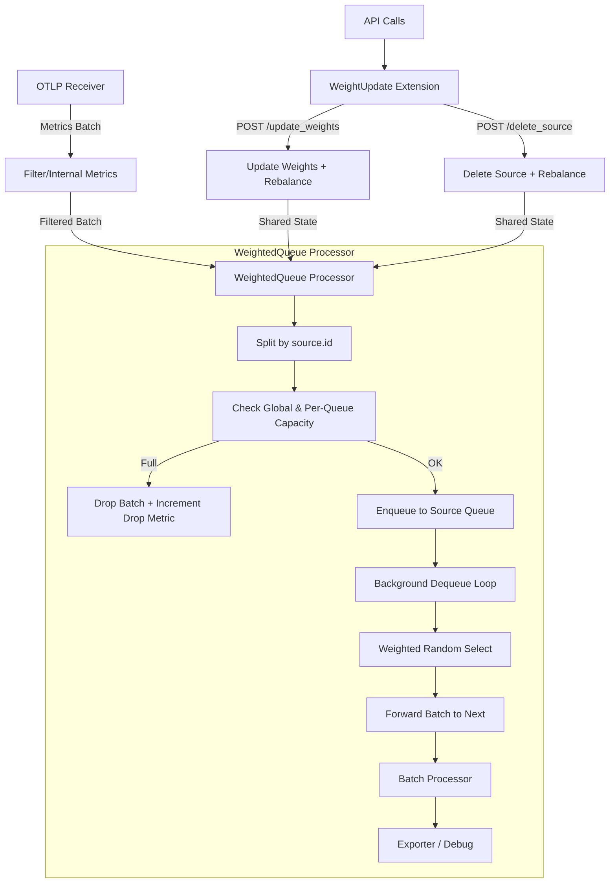

# **Custom OpenTelemetry Collector**: **Weighted Queue Processor**

<p align="center"> <a href="https://github.com/open-telemetry/opentelemetry-collector">  </a> <a href="#weightedqueueprocessor">  </a> <a href="#weightupdateextension">  </a> <a href="https://go.dev/dl/">  </a> <a href="https://github.com/open-telemetry/opentelemetry-collector-releases/releases/tag/v0.142.0">  </a>     </p>

This project provides a **custom OpenTelemetry Collector distribution** that introduces a **stateful**, **weighted, per-tenant queueing processor** for **metrics**, together with a lightweight **HTTP control extension**.

The purpose of this collector is to enable **priority-aware** and **SLO-driven telemetry forwarding** in **multi-tenant observability pipelines**, where multiple independent sources share a common collector and backend.

This design turns the OpenTelemetry Collector from a passive relay into an **active, policy-enforcing data-plane component**, suitable for **research, experimentation, and future upstream integration**.

## **Conceptual Overview**
In modern observability deployments, telemetry from multiple independent tenants (for example, **edge sites**, **operators**, or **application domains**) is often aggregated by a shared collector. Under high load, this leads to two fundamental challenges:

1. **Noisy neighbors** — one tenant can overwhelm the collector and degrade observability for others  
2. **Priority and SLO enforcement** — some tenants must receive preferential treatment to maintain freshness, reliability, or contractual SLOs  

This custom collector addresses these challenges by introducing **explicit per-tenant queueing** combined with **weighted scheduling**. Each tenant’s telemetry is isolated in its own queue, and forwarding decisions are made probabilistically according to configurable **weights**.

Weights can be **updated at runtime** via an HTTP API, enabling **dynamic, SLO-aware control** without restarting the collector.

This component acts as a **data-plane enforcement primitive** that can be driven by external **policy engines**, **planners**, or **learning-based controllers**.

## **Tenant Model and Source Identification**
Each telemetry source represents a **logical tenant**, such as an edge cluster, operator, or application group.

Tenants are identified by a configurable **resource attribute** attached to incoming metrics. By default, the processor uses ``source.id``.

All metric batches sharing the same ``source.id`` value are treated as belonging to the same tenant and are routed through the same internal queue.

This establishes:
- **Isolation** between tenants via independent queues  
- **Controlled sharing** of collector resources via weighted scheduling  

## **Key Components**
### **Weighted Queue Processor** (``weightedqueueprocessor``)   

A custom **metrics processor** that:

- Groups incoming metric batches by a configurable resource attribute (default: ``source.id``)
- Maintains a separate bounded queue per tenant
- Automatically detects new tenants and assigns **equal weights** by default
- Forwards batches using **weighted random selection**
- Enforces **global** and **per-tenant** capacity limits
- Exposes internal metrics for observability and analysis

The processor is implemented using **official OpenTelemetry Collector interfaces** and operates fully within standard collector semantics.

### **Weight Update Extension** (``weightupdateextension``)

A lightweight **HTTP extension** that exposes runtime control over tenant weights.

It provides the following endpoints:

- ``POST /update_weights``
  Updates tenant weights dynamically using a JSON payload. Example request:  
  Updates tenant weights dynamically using a JSON payload, for example:  
  ```json
  {
    "weights": {
      "src1": 0.6,
      "src2": 0.4
    }
  }
  ``` 

  Weights must sum approximately to ``1.0``.

- ``GET /weights``  
Returns the currently active weights and the number of detected tenants.

- ``POST /delete_source``  
Deletes a tenant queue (by tenant id) and rebalances scheduling state accordingly.

The extension shares state directly with the processor using **OpenTelemetry-supported patterns**, enabling safe and low-latency runtime updates.

## **Configuration vs Runtime State**

This collector uses a **static pipeline configuration** defined in ``config.yaml`` (receivers → processors → exporters). The pipeline graph and component wiring are fixed at startup.

The ``weightedqueueprocessor`` is intentionally **stateful** at runtime:

- It maintains **in-memory per-tenant queues** (bounded buffers).
- It maintains **runtime scheduling state** (tenant weights) that controls how queues are drained.

The HTTP API provided by ``weightupdateextension`` updates **runtime scheduling state only**. It does **not** modify the collector pipeline configuration, receiver/exporter settings, or processor ordering. 

The API provides a control-plane hook through which external logic can influence internal scheduling behavior without participating in the core telemetry execution path.

This distinction matters: the collector is **not** hot-reloading its configuration; it is updating **internal scheduling state** used for queue draining. This preserves OpenTelemetry’s static configuration model while enabling safe runtime adaptation.

## **Scheduling Semantics**

Forwarding decisions are made using **weighted random selection** across all active tenant queues.

At each dequeue opportunity:
- one tenant queue is selected with probability proportional to its configured weight  
- one batch from that queue is forwarded downstream  

This provides:
- **probabilistic fairness** across tenants  
- **priority differentiation** without strict rate enforcement  
- convergence to configured weights over time  

The processor **does not guarantee exact per-window throughput ratios**. Instead, it guarantees that over a sufficiently large number of forwarded batches, each tenant’s share converges to its assigned weight.

This design choice keeps the processor **simple**, **efficient**, and suitable for **high-throughput telemetry pipelines**.


## **Overload and Backpressure Behavior**

The processor enforces both **global** and **per-tenant** capacity limits.

When a queue exceeds its configured capacity:
- incoming batches for that tenant are **dropped**
- drops are **logged** and **exposed via metrics**
- upstream backpressure naturally propagates (for example, through ``otlp`` retry or drop behavior)

Importantly:
- **no blocking** is introduced in the collector pipeline  
- overload in one tenant **does not stall others**  
- the collector maintains **availability under stress**

This enables **predictable degradation** and makes overload behavior explicit and observable.

## **Runtime Updates and Safety Guarantees**

Runtime updates are designed to be **safe, bounded, and non-disruptive**.

### **Validation invariants**
When applying a weight update, the system enforces:

- All weights are **non-negative**.
- The update includes **exactly one weight per active tenant queue** (no missing or extra tenants).
- Weights must sum approximately to ``1.0`` (within a small tolerance).
- Updates that violate invariants are rejected with a clear error response and **do not change** the current scheduling state.
- Updates are applied **atomically**, ensuring that scheduling state is never observed in a partially updated or inconsistent form.

### **Update scope**
A weight update affects **only** the selection probability used by the processor’s dequeue loop (i.e., how queues are drained). It does not:

- change the collector pipeline graph
- add/remove processors/exporters dynamically
- alter receiver behavior
- modify resource attributes or telemetry content

### **Stability under load**
The processor is designed for **availability-first behavior** under overload:

- Queues are **bounded** (per-tenant and/or global limits).
- When a queue is full, incoming batches for that tenant are **dropped**.
- Drops are logged and exposed via metrics.
- Failures propagate upstream through normal Collector semantics, enabling graceful retry/drop behavior without crashing the collector.


## **Observability**

The processor exposes Prometheus-style metrics, including:

- ``weightedqueue_queue_length{source="..."}``  
  Current queue length per tenant

- ``weightedqueue_dropped_batches``  
  Total number of dropped metric batches

These metrics enable operators and experiments to:
- observe **per-tenant pressure**
- study **fairness and starvation effects**
- evaluate **SLO compliance under load**

## Flow Diagram
The following diagram illustrates the runtime flow of metric batches through the collector and the interaction between the processor and the control extension:



## Intended Use Cases
This component is designed for:
- **multi-tenant observability aggregation**
- **priority-aware telemetry forwarding**
- **SLO-driven observability control**
- **overload testing and failure analysis**
- **research on adaptive observability pipelines**

## Project Structure
```
otel-custom/
├── prioqueue-collector/
│   ├── manifest.yaml                # OCB manifest: defines modules, versions, and build output
│   └── config.yaml                  # Collector runtime config (receivers, processors, exporters)
│
├── weightupdateextension/           # Custom OTEL extension: exposes HTTP API for weight updates
│   ├── config.go                    # Extension configuration schema
│   ├── extension.go                 # HTTP server + handlers
│   ├── factory.go                   # OTEL factory registration
│   ├── shared.go                    # Shared state (weights, source count)
│   └── go.mod
│
├── weightedqueueprocessor/          # Custom OTEL processor: weighted per-source queueing
│   ├── config.go                    # Processor configuration schema
│   ├── processor.go                 # Core queueing + weighted selection logic
│   ├── factory.go                   # OTEL factory registration
│   └── go.mod
│
├── Makefile                         # Build, release, multi-arch Docker, and tooling commands
├── Dockerfile
└── README.md                        # Documentation for building and running the custom collector
```

## Prerequisites
- Go 1.25+
- OpenTelemetry Collector Builder (OCB):  
    ```bash
    go install go.opentelemetry.io/collector/cmd/builder@latest
    ```

## Building the Custom Collector
The project includes a Makefile that handles compilation, artifact organization, and release output.

To build the collector binary:

```bash
make build-bin
```

This produces the executable at `prioqueue-collector/build/prioqueue-collector`.

For a full release workflow (binary + checksum + summary):
```bash
make release
```

## Running the Custom Collector
Run the collector using the provided configuration (or your own):

```bash
./prioqueue-collector/build/prioqueue-collector --config prioqueue-collector/config.yaml
```

By default:
- OTLP receivers listen on ports 4317 (gRPC) and 4318 (HTTP)
- the weight update API listens on port 4500

## Docker Support
You can build and run the collector using Docker directly or via the Makefile.

#### Build the image (local architecture)
```bash
make docker-build
```
This produces a single‑architecture image matching your local machine (e.g., amd64 on Linux, arm64 on Apple Silicon).

Push that single‑arch image to your registry:
```bash
make docker-push
```

#### Multi‑Arch Docker Builds
To build images for both amd64 and arm64, use Docker Buildx:
```bash
make docker-buildx
```
This creates two images—one per architecture—without pushing them.

To build and push a multi‑arch image (with a manifest that automatically serves the correct architecture):
```bash
make docker-pushx
```
This creates a multi‑architecture manifest so that
- amd64 machines pull the amd64 image
- arm64 machines pull the arm64 image

automatically.

#### Running the Collector in Docker
```bash
docker run --rm \
  -p 4317:4317 -p 4318:4318 -p 4500:4500 -p 8888:8888 \
  -v $(pwd)/prioqueue-collector/config.yaml:/etc/otelcol/config.yaml \
  prioqueue-collector:latest
```

### API Usage
- Retrieve current weights:

    ```bash
    curl http://localhost:4500/weights
    ```

    Example response:

    ```json
    {
    "weights": {
        "src1": 0.6,
        "src2": 0.3,
        "src3": 0.1
    },
    "num_sources": 3
    }
    ```

- Update weights:

    ```bash
    curl -X POST http://localhost:4500/update_weights \
    -H "Content-Type: application/json" \
    -d '{"weights": {"src1": 0.7, "src2": 0.2, "src3": 0.1}}'
    ```

## Customization
| Setting            | Path in `config.yaml`                                         | Description                                   |
|--------------------|-------------------------------------------------------------|-----------------------------------------------|
| API Port           | `extensions.weightupdate.port`                              | Default: `4500`                               |
| Source Attribute   | `processors.weightedqueue.source_attribute`                 | Default: `source.id`                          |
| Initial Weights    | `processors.weightedqueue.initial_weights`                  | Optional initial map                          |
| Max Total Capacity | `processors.weightedqueue.max_total_capacity`               | Global capacity split equally across tenants  |
| Poll Interval      | `processors.weightedqueue.poll_interval_ms`                 | Dequeue frequency                             |

## Upstream Considerations

This processor and extension are developed as **standalone components** to enable rapid experimentation and research iteration.

The implementation follows **official OpenTelemetry Collector interfaces and patterns**, keeping the path open for future inclusion in **OpenTelemetry Collector Contrib** if the design proves stable and broadly useful.

## Troubleshooting
- **Build fails:** Run `go mod tidy` in each module directory.
- **API not working:** Confirm extension is listed in `service.extensions`.
- **Batches dropped:** Increase `max_total_capacity` or reduce `poll_interval_ms`.
- **No rebalancing:** Ensure incoming data has the correct `source.id` attribute.